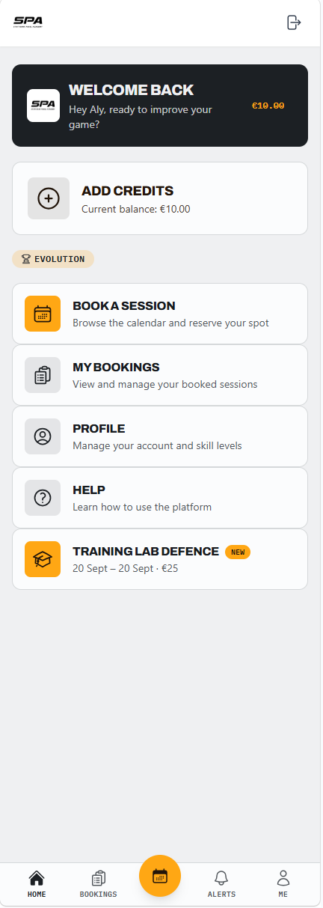
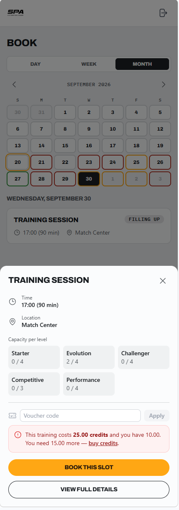
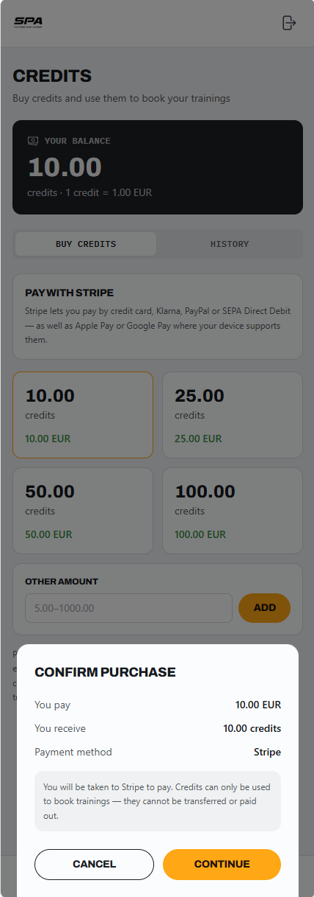
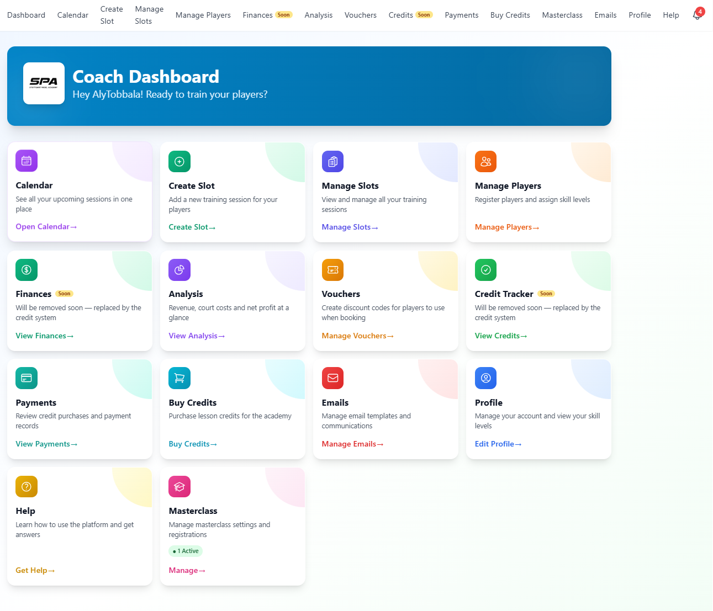

# 🎾 Stuttgart Padel Academy — Booking & Coaching Platform

> A full-stack web app that lets a padel academy run its coaching business online: players book and pay for sessions, coaches manage slots and finances — replacing spreadsheets and chat threads.

### 👉 [LIVE DEMO](https://academy.stuttgart-padel.com)

<p align="center">
  
  
  
</p>
<p align="center"><em>Player app: home · calendar booking by skill level · credit top-up</em></p>


*Coach console: sessions, players, vouchers, payments, emails and masterclasses*

---

## Tech Stack

| Layer | Technology |
|---|---|
| **Frontend** | React 18, TypeScript, Vite, Tailwind CSS, React Router, Headless UI, Recharts, date-fns |
| **Backend** | Node.js, Express, TypeScript (REST API) |
| **Database & Auth** | Firebase Authentication, Cloud Firestore |
| **Payments** | Stripe, PayPal (behind a provider-neutral abstraction) |
| **Integrations** | Google Calendar API (OAuth), Brevo transactional email |
| **Infra / Tooling** | Netlify (frontend hosting, SPA routing), Railway (backend API hosting), Node cron jobs, ESLint |

## Architecture

```
            ┌──────────────────────────┐
            │  React SPA (Netlify)     │
            │  player app + coach admin│
            └───────┬──────────┬───────┘
     sign-in / ID   │          │  REST/JSON + Bearer token
     token          ▼          ▼
        ┌────────────────┐  ┌──────────────────────────────┐
        │ Firebase Auth  │─▶│ Express API (Railway)        │
        └────────────────┘  │  • token verification        │
                            │  • role-based access control │
                            │  • domain services           │
                            │  • scheduled jobs (cron)     │
                            └──┬─────────┬──────────┬──────┘
                               ▼         ▼          ▼
                        ┌──────────┐ ┌────────┐ ┌────────────────────┐
                        │Firestore │ │ Brevo  │ │ Google Calendar    │
                        └──────────┘ │ (email)│ └────────────────────┘
                               ▲     └────────┘
                               │
              ┌────────────────┴─────────────┐
              │ Stripe / PayPal webhooks     │
              │ (signature-verified, replay- │
              │  safe) → normalised events   │
              └──────────────────────────────┘
```

- **Frontend:** a single-page app with two experiences — a mobile-first player app and a coach/admin console — sharing one codebase.
- **Auth:** Firebase handles identity; the API verifies every request's token and enforces player vs. coach roles server-side.
- **Backend:** a layered Express API (routes → services → data access) with separate domains for slots, bookings, credits/wallet, vouchers, notifications and finance reporting.
- **Payments:** providers are hidden behind an adapter interface, so a new payment method is one adapter, not a rewrite.
- **Background work:** scheduled jobs send session reminders and expire time-limited offers.

## What I Built

*Solo project — I designed, built, and deployed everything end to end.*

- **Player app:** mobile-first UI to browse sessions by skill level, book, cancel, join waitlists and manage a profile
- **Coach console:** create and manage recurring session series, players, masterclasses, and view finance/analytics dashboards (charts)
- **Prepaid credits wallet:** top-up via card/PayPal, spending, refunds, and an auditable transaction history
- **Vouchers & masterclass registration** flows
- **Waitlist with time-limited spot offers:** when a place opens up, the next player is offered it automatically
- **Notifications:** in-app alerts plus transactional email and 24h reminders
- **Google Calendar sync** using narrowly-scoped OAuth (only touches a calendar the app creates)
- **Role-based access control**, privacy-policy consent, and German-language legal pages (GDPR-aware)
- **Deployment & operations:** SPA on Netlify, API on Railway, environment-based config, admin maintenance scripts

## Technical Challenges Solved

1. **Money-safe credits ledger.** Balances can't drift or double-charge even with retries and concurrent requests. Solved with an append-only ledger, database transactions, and idempotency keys derived from the triggering event.
2. **Reliable payment webhooks.** Signature verification needs the raw request body, and providers retry events. Built a provider-neutral event layer with signature checks and replay protection so Stripe and PayPal flow through identical downstream logic.
3. **Fair, race-free waitlists.** Cancellations, offers, expiries, and coach overrides can all hit the same spot at once. Modelled offers as an explicit state machine, transactionally resolved, so a place is never double-booked or silently lost.

## Note

📌 **The source code is kept private** (it's a live, commercial system with real users and payments). I'm happy to give a **live code walkthrough** or screen-share — feel free to reach out:

- 📧 alytobbala@gmail.com

© Aly Tobbala. All rights reserved.
